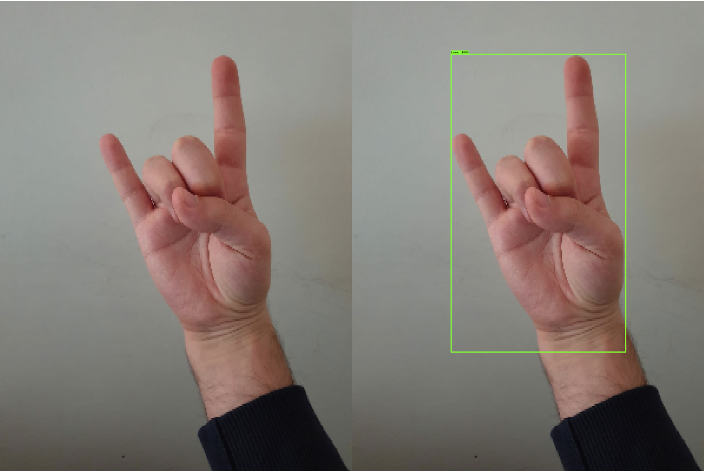

# Object Detection Train

In today's world, most of technological developments happened and continue to happen. One of the technological field is Artificial Intelligence no doubt. If AI is examined, it can be easily seen that there are also many different type of fields in AI. One of these fields is Computer Vision. When viewed from sources of today, it will be seen that there are still many unsolved problems in some fields of CV such as Drones, Robots, Traffic Cameras, Autonomous Cars etc. Mainly, most of today's car companies have investment in that field. They can detect the objects very well. However, when thinking the moving humans' behaviours classification, these do not have very good results actually. As an example of that, matterport, openPose by CMU, Microsoft has really useful works that is Microsoft Coco API for object detection.

In this project, firstly, one of the leading companies’ project, that is Microsoft Coco API, will be examined and tried to use, secondly, what problems and outcomes are seen when processing the data, will be tried to understand through using Tensorflow. All of these will try on Google Colab platform, which is recommended for research projects. This platform is another useful platform to try and to understand basic projects freely. This project will be mainly on hand gestures  and will try to classify their meanings. 

### Train Images

### Example Result

### Note:
You can check more details from the project report in this repository. 

This repository is has been prepared through help from DLology Blog.
